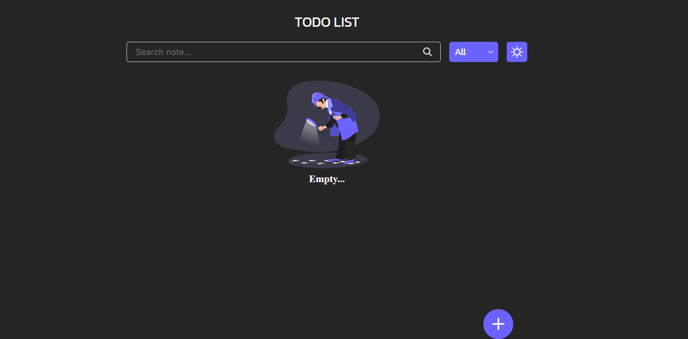

# ✅ TODO List (Görüləcək İşlər Siyahısı)

Bu layihə JavaScript, HTML və CSS vasitəsilə hazırlanmış sadə, istifadəsi rahat və funksional bir **Görüləcək İşlər (TODO) siyahısı** tətbiqidir.

## 🔍 Xüsusiyyətlər

- 📝 Yeni qeyd əlavə etmək
- ✏️ Mövcud qeydləri redaktə etmək
- 🗑️ Qeydləri silmək
- ✅ Qeydi tamamlanmış kimi işarələmək (və ya geri almaq)
- 🔎 Axtarış funksiyası ilə qeydləri filtrləmək
- 🗂️ "Hamısı", "Tamamlananlar" və "Tamamlanmayanlar" üzrə süzgəc
- 🌙 Gecə/Gündüz rejimi (Dark Mode)
- 💾 Bütün məlumatlar `localStorage` üzərində saxlanılır (brauzer yaddaşı)

## 🛠️ Texnologiyalar

Layihə aşağıdakı texnologiyalar ilə hazırlanmışdır:

- HTML5
- CSS3
- JavaScript (Vanilla JS)
- `localStorage` (məlumat saxlamaq üçün)

## 📸 Ekran Görüntüləri




## ▶️ İstifadə Qaydası

1. Repozitoriyanı klonlayın:

   ```bash
   git clone https://github.com/istifadeci-adiniz/todo-list.git
   ```

2. Layihə qovluğuna daxil olun:

```bash
   cd todo-list

```

3. `index.html` faylını brauzerdə açaraq tətbiqi istifadə edin.
